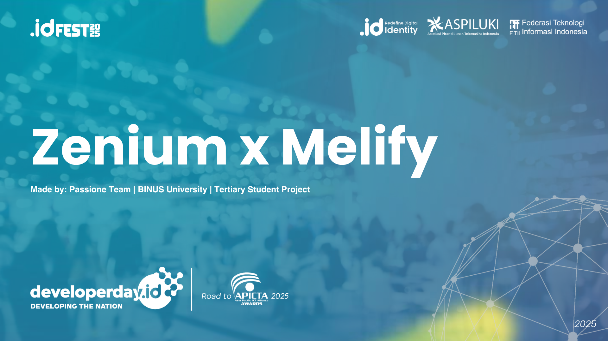
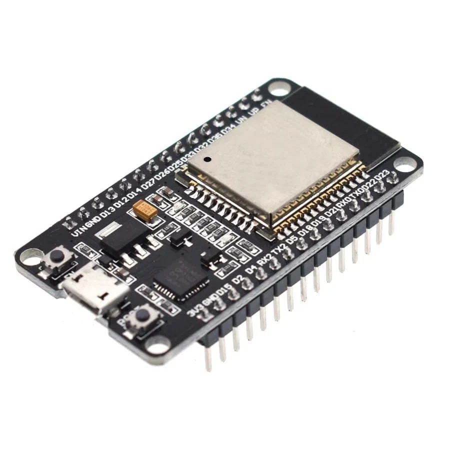
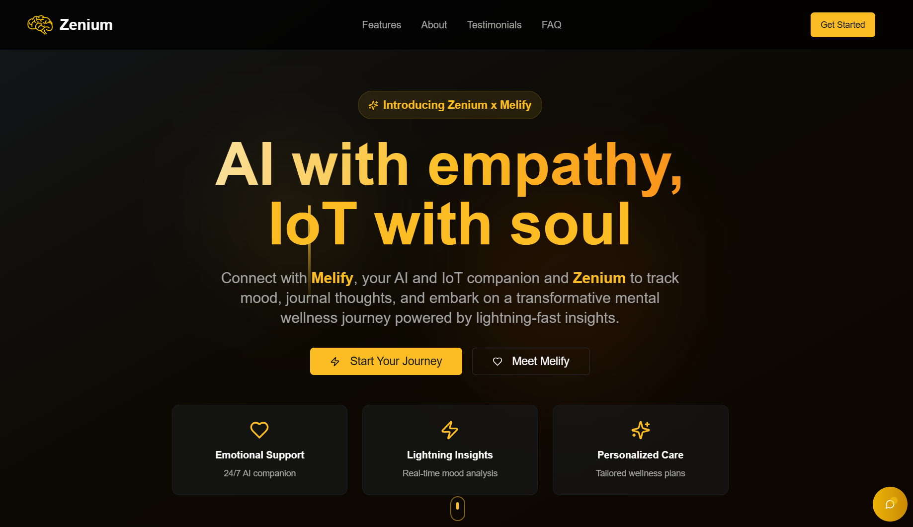

<div align="center">
    <div>
        
    </div>
    <div>
            <h3><b>Zenium x Melify</b></h3>
            <p><i>AI with empathy, IoT with soul</i></p>
    </div>
</div>
<br>
<h1 align="center">Zenium x Melify - Developer Day: Road to APICTA Awards 2025</h1>
<div align="center">



</div>
<br>

<b>Zenium</b> is an AI-powered progressive web app combined with <b>Melify</b>, a smart IoT companion doll. Together, they deliver personalized, empathetic, and interactive mental health support. In a time where stress, anxiety, and loneliness are increasing globally, Zenium x Melify empowers individuals to track their well-being, interact naturally, and receive proactive emotional support through AI, IoT, and geospatial intelligence.  

<a href="https://www.canva.com/design/DAGxCitBZzc/JU5sxBhwLXI6WgqbcerFjA/edit?utm_content=DAGxCitBZzc&utm_campaign=designshare&utm_medium=link2&utm_source=sharebutton">Pitch Deck Link</a>

---

## 📃 Table of Contents
- [⚙️ Technology Stack](#-technology-stack)
- [🧩 Core Features](#-core-features)
- [🚀 Live Demo](#-live-demo)
- [🧰 Getting Started Locally](#-getting-started-locally)
- [🔐 .env Configuration](#-env-configuration)
- [📸 Website Preview](#-website-preview)
- [🧭 Diagram](#-diagram)
- [👥 Owner](#-owner)
- [📬 Contact](#-contact)

---

## ⚙️ Technology Stack

<div align="center">

<kbd></kbd>
<kbd></kbd>
<kbd></kbd>
<kbd></kbd>
<kbd></kbd>
<kbd></kbd>
<kbd></kbd>
<kbd></kbd>
<kbd></kbd>
<kbd></kbd>
<kbd></kbd>
<kbd></kbd>
<kbd></kbd>

</div>

<div align="center">
<h4>React | TypeScript | Vite | Tailwind CSS | Shadcn UI | MongoDB | Express JS | Node JS | Python | Flask | Hugging Face | Docker | ESP32</h4>
</div>

---

## 🧩 Core Features

### 🌐 Zenium (Progressive Web App)
- **Mood Check-ins & AI Journaling**: track emotions, get personalized reflection & advice.  
- **AI Chat Companion**: empathetic dialogue with LLM-based mental health coach.  
- **Geospatial Insights**: detect patterns of stress vs environment (e.g., urban noise, location).  
- **Self-help Toolkit**: guided meditation, CBT-based exercises, and mindfulness practices.  
- **Crisis Detection**: auto-detect risk of depression/anxiety with alert routing.  

### 🧸 Melify (Smart IoT Doll)
- **Voice Interaction**: natural conversations with AI.  
- **Emotion Detection**: sensors for tone, stress, and environment.  
- **Haptic Feedback**: warmth, vibrations, or soothing responses.  
- **Connected Companion**: sync with Zenium app for real-time updates.  

---

## 🚀 Live Demo

👉 [https://www.zenium-melify.id](https://www.zenium-melify.id)

---

## 🧰 Getting Started Locally

### Prerequisites
- **Node.js** (v16+)
- **MongoDB**
- **Python 3.9+**  
- **IoT Device**: ESP32 with microphone, speaker, haptic motor
- **Docker** (optional)
- **Git**

### Clone the Project

#### To run the Frontend
```bash
git clone https://github.com/StyNW7/Zenium.git
cd Zenium
cd Frontend
npm install
npm run dev
```

#### To run the Backend
```bash
cd Backend
npm install
npm run dev
```

#### To run the AI
```bash
cd AI
# Make Virtual Environment
python -m venv .venv
source .venv/bin/activate # Windows: .venv\Scripts\activate
pip install -r requirements.txt

# Run the flask api python (in the root folder)
python app.py
```

---

## 🔐 .env Configuration

.env for the Frontend
```
VITE_API_BASE_URL=http://localhost:3000/api
```

.env for the Backend
```
MONGO_URI=
OPENROUTER_API_KEY=
SMTP_HOST=smtp.gmail.com
SMTP_PORT=587
SMTP_USER=
SMTP_PASS=
EMAIL_FROM=
NODE_ENV=development

AZURE_OPENAI_KEY=
AZURE_OPENAI_ENDPOINT=
AZURE_API_VERSION=2024-12-01-preview
AZURE_OPENAI_DEPLOYMENT=gpt-35-turbo
```

.env for the AI
```
OPENAI_API_KEY=
OPENAI_MODEL=
```

---

## 📸 &nbsp;Website Preview
<table style="width:100%; text-align:center">
    <col width="100%">
    <tr>
        <td width="1%" align="center"></td>
    </tr>
    <tr>
        <td width="1%" align="center">Home Page</td>
    </tr>
    <tr>
        <td width="1%" align="center"></td>
    </tr>
    <tr>
        <td width="1%" align="center">Crafts Page</td>
    </tr>
    <tr>
        <td width="1%" align="center"></td>
    </tr>
    <tr>
        <td width="1%" align="center">Inventory Page</td>
    </tr>
    <tr>
        <td width="1%" align="center"></td>
    </tr>
    <tr>
        <td width="1%" align="center">Play Page</td>
    </tr>
    <tr>
        <td width="1%" align="center"></td>
    </tr>
    <tr>
        <td width="1%" align="center">Journey Recap Page</td>
    </tr>
    <tr>
        <td width="1%" align="center"></td>
    </tr>
    <tr>
        <td width="1%" align="center">Heritage Books Page</td>
    </tr>
    <tr>
        <td width="1%" align="center"></td>
    </tr>
    <tr>
        <td width="1%" align="center">3D Monument Quest Game</td>
    </tr>
</table>

---

## 🧭 Diagram

*Overall Database System Flow:*
<p align="center">
  
</p>

This diagram shows how the models connected using ERD Diagram

---

## 👥 Owner

This Repository is created by Passione Team - Tertiary Student Project
<ul>
<li>Stanley Nathanael Wijaya - Team Lead and Frontend Dev</li>
<li>Jason Brandon Loi - Fullstack Developer</li>
<li>Greschen Chin - AI Engineer</li>
</ul>
As innovation project for APICTA Awards 2025.

---

## 📬 Contact
Have questions or want to collaborate?

- 📧 Email: stanley.n.wijaya7@gmail.com
- 💬 Discord: `stynw7`

<code>Made with ❤️ by Passione Team</code>