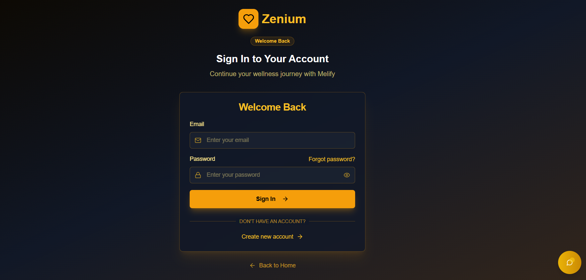
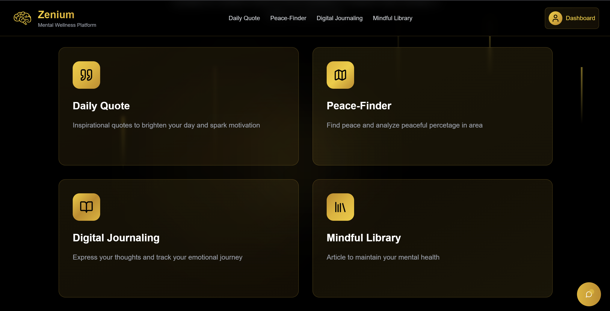
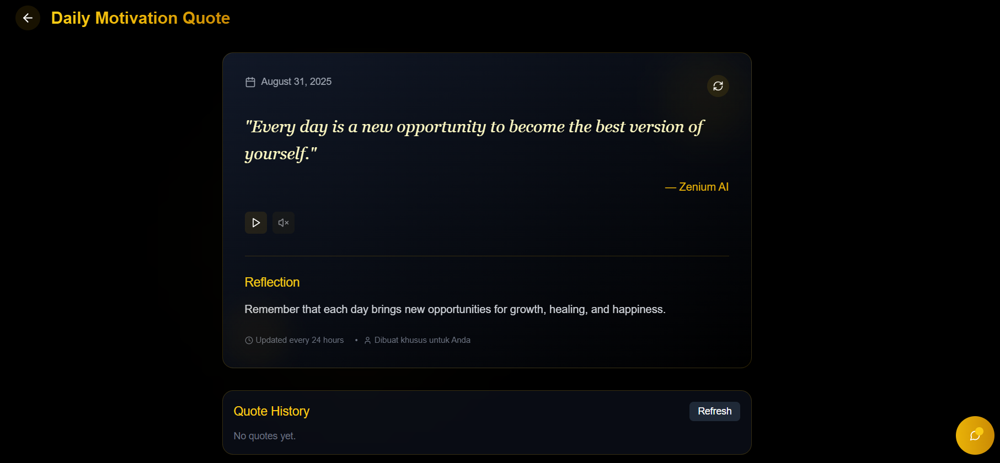
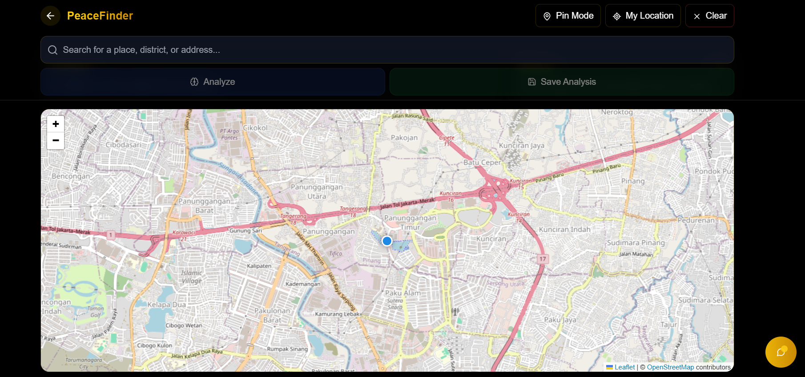
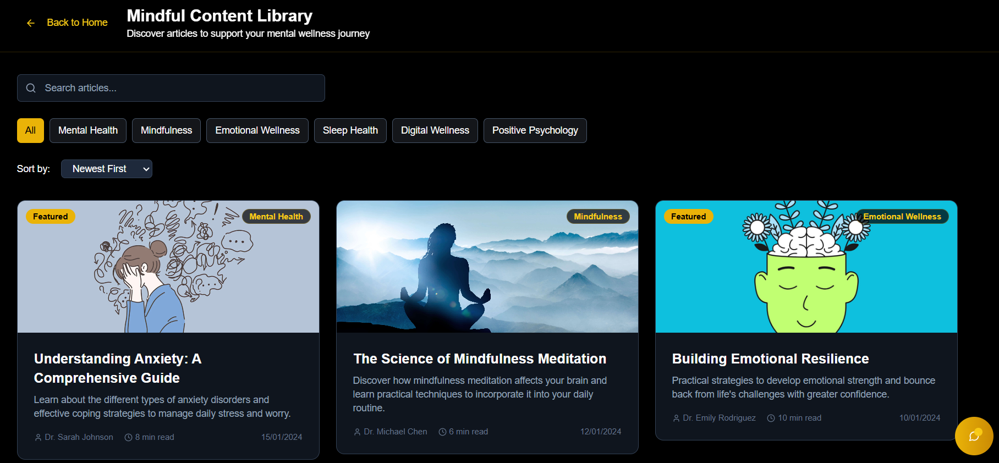
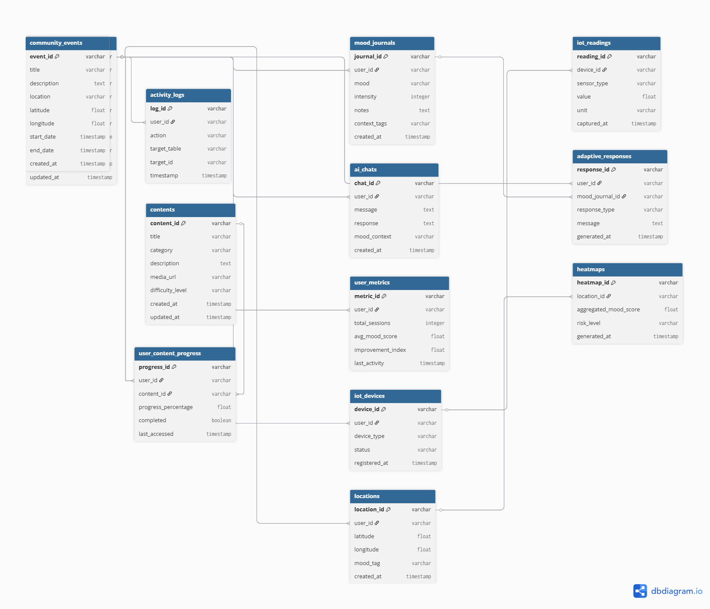

<div align="center">
    <div>
        
    </div>
    <div>
            <h3><b>Zenium x Melify</b></h3>
            <p><i>AI with empathy, IoT with soul</i></p>
    </div>
</div>
<br>
<h1 align="center">Zenium x Melify - Developer Day: Road to APICTA Awards 2025</h1>
<div align="center">


</div>
<br>

<b>Zenium</b> is an AI-powered progressive web app combined with <b>Melify</b>, a smart IoT companion doll. Together, they deliver personalized, empathetic, and interactive mental health support. In a time where stress, anxiety, and loneliness are increasing globally, Zenium x Melify empowers individuals to track their well-being, interact naturally, and receive proactive emotional support through AI, IoT, and geospatial intelligence.  

<a href="https://www.canva.com/design/DAGxCitBZzc/JU5sxBhwLXI6WgqbcerFjA/edit?utm_content=DAGxCitBZzc&utm_campaign=designshare&utm_medium=link2&utm_source=sharebutton" target="_blank">Canva Pitch Deck Link</a>

<a href="https://s.id/Zenium-Demo-Video" target="_blank">Product Demo Video</a>

---

## 📃 Table of Contents
- [⚙️ Technology Stack](#-technology-stack)
- [🧩 Core Features](#-core-features)
- [🚀 Live Demo](#-live-demo)
- [🧰 Getting Started Locally](#-getting-started-locally)
- [🔐 .env Configuration](#-env-configuration)
- [📸 Website Preview](#-website-preview)
- [🧭 Diagram](#-diagram)
- [👥 Owner](#-owner)
- [📬 Contact](#-contact)

---

## ⚙️ Technology Stack

<div align="center">

<kbd></kbd>
<kbd></kbd>
<kbd></kbd>
<kbd></kbd>
<kbd></kbd>
<kbd></kbd>
<kbd></kbd>
<kbd></kbd>
<kbd></kbd>
<kbd></kbd>
<kbd></kbd>
<kbd></kbd>
<kbd></kbd>

</div>

<div align="center">
<h4>React | TypeScript | Vite | Tailwind CSS | Shadcn UI | MongoDB | Express JS | Node JS | Python | Flask | Hugging Face | Docker | ESP32</h4>
</div>

---

## 🧩 Core Features

---

### ✨ Zenium Features

* **Mood Journal & Tracking**
  Users can log their emotions daily, identify mood patterns over time, and receive data-driven feedback to improve self-awareness.

* **Mindful Content Library**
  A curated collection of mindfulness exercises, guided meditations, and educational resources tailored to different emotional states.

* **AI-powered Chat Companion**
  An intelligent conversational agent that provides empathetic, context-aware support, helping users manage stress, anxiety, or daily struggles.

* **Progress Dashboard**
  A visual dashboard that tracks emotional trends, personal milestones, and improvements in mental wellness over time.

* **Geospatial Wellness Insights**
  Location-based analytics that provide insights into how environments and communities may influence mood and mental health.

* **Seamless IoT Integration**
  Works with IoT devices (e.g., wearables, smart home sensors) to capture real-time physiological or environmental data, enriching wellness tracking.

### 🔊 Melify Features

* **Voice AI Interaction**
  Hands-free, natural conversations with AI through voice commands, making mental health support accessible anytime.

* **Mood-Adaptive Response**
  The system adapts tone, content, and recommendations based on the user’s detected emotional state, creating personalized experiences.

* **Computer Vision**
  Uses camera input to detect facial expressions, stress levels, or fatigue cues (with user consent) to support real-time mood analysis.

* **IoT Sensors Integration**
  Collects environmental and biometric data (e.g., room lighting, noise, heart rate) to contextualize mental wellness monitoring.

* **Personalized Support**
  Provides tailored feedback, exercises, and interventions depending on the individual’s needs and usage patterns.

### 🌍 Geospatial Features

* **Heatmaps & Risk Mapping (Aggregate)**
  Aggregates anonymized community data into heatmaps to visualize regions with higher stress or wellness risks. Useful for public health and community interventions.

* **Event & Community Discovery by Location**
  Suggests local wellness events, workshops, or support groups near the user to foster real-world connection and healing.

* **Context-Aware Mood Tagging**
  Combines geolocation with mood entries, allowing users to understand how specific places affect their emotions.

👉 Together, **Zenium x Melify** integrates **AI, IoT, and geospatial intelligence** into a unified ecosystem for **personal and community mental wellness enhancement**.

---

## 🚀 Live Demo

👉 [https://www.zenium-melify.id](https://www.zenium-melify.id)

---

## 🧰 Getting Started Locally

### Prerequisites
- **Node.js** (v16+)
- **MongoDB**
- **Python 3.9+**  
- **IoT Device**: ESP32 with microphone, speaker, haptic motor
- **Docker** (optional)
- **Git**

### Clone the Project

#### To run the Frontend
```bash
git clone https://github.com/StyNW7/Zenium.git
cd Zenium
cd Frontend
npm install
npm run dev
```

#### To run the Backend
```bash
cd Backend
npm install
npm run dev
```

#### To run the AI
```bash
cd AI
# Make Virtual Environment
python -m venv .venv
source .venv/bin/activate # Windows: .venv\Scripts\activate
pip install -r requirements.txt

# Run the flask api python (in the root folder)
python app.py
```

---

## 🔐 .env Configuration

.env for the Frontend
```
VITE_API_BASE_URL=http://localhost:3000/api
```

.env for the Backend
```
MONGO_URI=
OPENROUTER_API_KEY=
SMTP_HOST=smtp.gmail.com
SMTP_PORT=587
SMTP_USER=
SMTP_PASS=
EMAIL_FROM=
NODE_ENV=development

AZURE_OPENAI_KEY=
AZURE_OPENAI_ENDPOINT=
AZURE_API_VERSION=2024-12-01-preview
AZURE_OPENAI_DEPLOYMENT=gpt-35-turbo
```

.env for the AI
```
OPENAI_API_KEY=
OPENAI_MODEL=
```

---

## 📸 &nbsp;Website Preview
<table style="width:100%; text-align:center">
    <col width="100%">
    <tr>
        <td width="1%" align="center"></td>
    </tr>
    <tr>
        <td width="1%" align="center">Landing Page</td>
    </tr>
    <tr>
        <td width="1%" align="center"></td>
    </tr>
    <tr>
        <td width="1%" align="center">Login Page</td>
    </tr>
    <tr>
        <td width="1%" align="center"></td>
    </tr>
    <tr>
        <td width="1%" align="center">Features Page</td>
    </tr>
    <tr>
        <td width="1%" align="center"></td>
    </tr>
    <tr>
        <td width="1%" align="center">Daily Motivation Quote Page</td>
    </tr>
    <tr>
        <td width="1%" align="center"></td>
    </tr>
    <tr>
        <td width="1%" align="center">Peace Finder Geospatial Page</td>
    </tr>
    <tr>
        <td width="1%" align="center"></td>
    </tr>
    <tr>
        <td width="1%" align="center">Mindful Content Library Page</td>
    </tr>
    <tr>
        <td width="1%" align="center"></td>
    </tr>
    <tr>
        <td width="1%" align="center">Create Journal Page</td>
    </tr>
</table>

---

## 🧭 Diagram

*Overall Database System Flow:*
<p align="center">
  
</p>

This diagram shows how the models connected using ERD Diagram

---

## 🔥 API Documentation

Postman Link:

[Zenium x Melify Postman](https://web.postman.co/workspace/a20bbd0f-459f-4e37-9cf5-07f235d2a4a2)

---

## 👥 Owner

This Repository is created by Passione Team - Tertiary Student Project
<ul>
<li>Stanley Nathanael Wijaya - Team Lead and Frontend Dev</li>
<li>Jason Brandon Loi - Fullstack Developer</li>
<li>Greschen Chin - AI Engineer</li>
</ul>
As innovation project for APICTA Awards 2025.

---

## 📬 Contact
Have questions or want to collaborate?

- 📧 Email: stanley.n.wijaya7@gmail.com
- 💬 Discord: `stynw7`

<code>Made with ❤️ by Passione Team</code>